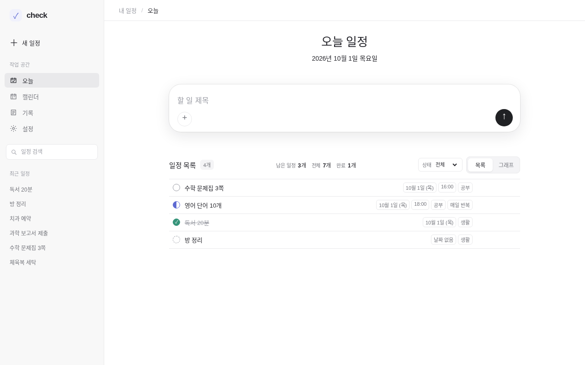
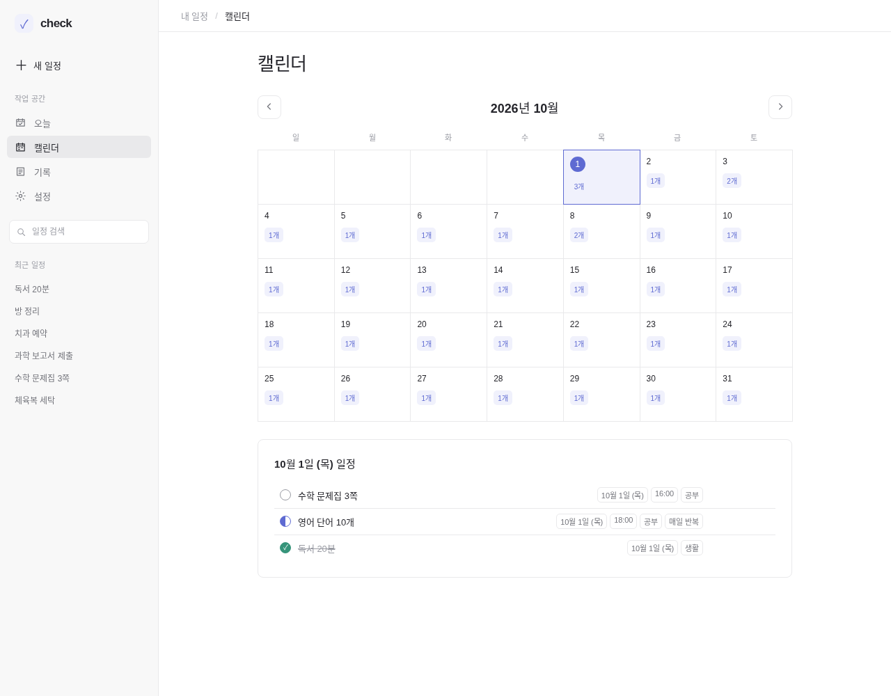
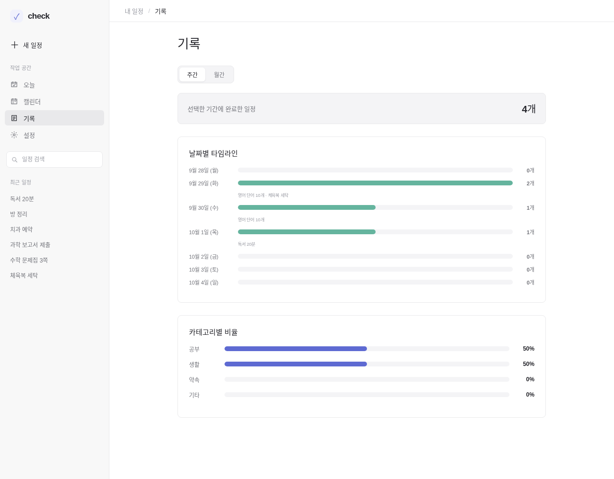

# check

## 1. 앱 이름과 한 줄 소개

**check**는 오늘 할 일을 적고, 끝낸 것을 표시하고, 지난 기록을 돌아보는 개인 일정 관리 웹앱입니다.

## 2. 누구를 위한 앱인가

- 기획서(`docs/plan.md`) 기준으로 사용자는 만든 사람 한 명입니다.
- 일정을 자주 까먹는 사람이 자기 PC에서 혼자 쓰는 것을 목표로 합니다.
- 회원가입이나 다른 사람과의 공유 기능은 없습니다.

## 3. 할 수 있는 일

지금 실제로 동작하는 기능만 적었습니다.

- 일정 추가, 수정, 삭제
- 상태 바꾸기: 대기, 할 일, 진행 중, 완료, 취소
- 날짜 없는 할 일 추가
- 매일, 매주, 매월 반복 일정 만들기
- 캘린더에서 날짜별 일정 보기
- 기록 화면에서 주간·월간 완료 내역과 카테고리별 비율 보기
- 사이드바에서 제목으로 일정 검색
- 브라우저 알림 (브라우저가 열려 있고 권한을 허용했을 때만)

기획서에 있는 Gmail·디스코드 자동 등록, AI 요약은 아직 만들지 않았습니다.

### 화면 미리보기

아래 그림은 가상의 일정을 넣고 찍은 화면입니다.

**오늘 화면** — 할 일을 적고 상태를 바꿉니다.

**캘린더 화면** — 날짜를 누르면 그날 일정이 보입니다.

**기록 화면** — 완료한 일정을 날짜별, 카테고리별로 봅니다.

## 4. 사용 방법

1. **일정 추가**: 오늘 화면의 제목 칸에 할 일을 적고 `추가`를 누릅니다. 날짜, 시간, 반복, 카테고리, 메모는 `세부 설정`을 열어 넣을 수 있습니다.
2. **완료 표시**: 목록에서 일정의 상태 메뉴를 열어 `완료`를 고릅니다. 다시 `대기`를 고르면 완료가 풀립니다.
3. **삭제**: 일정 오른쪽의 삭제 버튼을 누릅니다. 반복 일정이면 전체를 지울지 한 번 더 묻습니다.

## 5. 실행 방법

- 작업 폴더의 `index.html`을 브라우저(Chrome, Edge, Safari)로 엽니다. 설치할 것은 없습니다.
- React 버전을 쓰려면 터미널에서 `npm ci` 다음 `npm run dev`를 실행하고 `http://localhost:3000`을 엽니다.

## 6. 확인 방법

자세한 점검표는 `docs/checklist.md`에 있습니다. 핵심 항목은 다음과 같습니다.

- 콘솔에 빨간 오류가 없다.
- 일정을 추가하면 목록에 한 번 나타난다.
- 완료로 바꾸면 취소선이 보이고, 대기로 되돌리면 사라진다.
- 가운데 일정을 지우면 그 일정만 사라지고 나머지는 순서대로 남는다.
- 빈 제목이나 공백만 넣으면 `일정 제목을 입력해 주세요.` 안내가 나온다.
- 새로고침하거나 탭을 닫았다 다시 열어도 일정과 상태가 남아 있다.

## 7. 데이터 저장 안내

- 일정은 브라우저의 `localStorage`에만 저장됩니다. 서버로 보내지 않습니다.
- 다른 브라우저나 다른 주소(`file://`, `localhost`, 배포 주소)에서는 서로 저장 공간이 달라 같은 일정이 보이지 않습니다.
- 브라우저 데이터를 지우면 일정도 사라집니다.
- 공개될 수 있는 앱이므로 실제 개인 일정 대신 가상의 데이터만 입력하세요.

## 8. 만든 과정

- **프롬프트 엔지니어링**: `docs/plan.md`와 `docs/prompt-design.md`에 목표, 사용자, 제약, 출력 형식, 완료 기준을 먼저 적어 AI에게 보내는 요청을 구체화했습니다.
- **하네스 엔지니어링**: `AGENTS.md`에 파일 구성, 작업 규칙, 보안 규칙, 확인 절차를 정해 AI가 지켜야 할 울타리를 만들고, `docs/checklist.md`로 매번 같은 기준으로 검사했습니다.
- **루프 엔지니어링**: `docs/loop-log.md`에 회차마다 실패한 기준, 보낸 피드백, 바뀐 파일, 재검증 결과를 기록하며 통과할 때까지 반복했습니다.

## 9. 배포 주소

배포 후 추가

## 10. AI 활용 표시

이 앱은 Codex의 도움을 받아 만들었고, 동작과 문서는 사람이 직접 확인했습니다.

## 알려진 문제

`docs/loop-log.md`의 디자인 비교 기록에 남아 있는 내용입니다.

- 현황: 코드만 본 Claude 평가에서는 두 기준 모두 8점에 도달하지 못했다. 평가 입력에 따라 점수가 달라 절대 점수로 취급할 수 없다. 목록과 대화의 핵심 화면 구조가 다르다는 지적은 반복되었으며, 실제 스크린샷 비교도 아직 하지 못했다. 평가를 위한 별도 표시 방식은 사용하지 않는다.
- 남은 한계: Claude의 평가는 코드 기반이다. 브라우저에서 실제 화면, 모바일 배치, 콘솔 오류를 직접 확인해야 한다.

1일차와 2일차 반복 기록표는 아직 비어 있어 기록된 기능 실패는 없습니다.
